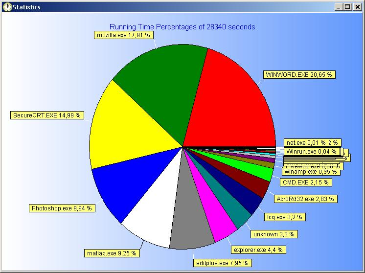

# TimeTrack 

Old code, for Windows 2000/XP. Requires You need Borland C++ Builder 5, ADVStringGrid to compile it yourself.

TimeTrack
=========

 Ever wondered how your time disappears during the day?  
TimeTrack is a very light application that may give you an answer!  
When run, it minimizes to systray and measures how much time you spent on each application/process/program without any user intervention. It counts automatically how many seconds each application has the focus.  
After 2 minutes of mouse or keyboard inactivity it stops counting. It's the only free application/task/activity measurement tool on the net that requires no user intervention, enjoy!

Hints:

* Session and Total times are the same, time is added to both columns. You can reset them at will.
* When timetrack exits, data is auto-saved on a text file (timetrack.csv).
* When timetrack starts, data is auto-loaded and counting continues.

Installation:
-------------

For Windows 2000/XP (and maybe 2003).  
No installation is needed, just run the .exe . A timetrack.csv file will be created in the same directory to store measurements.  

Screenshots:
------------

|     |     |
| --- | --- |
|  |  |

Click on the images for full size

  

Download:
---------

TimeTrack is Freeware  
Executable: [timetrack.rar](timetrack.rar) Version 0.7  
Source: [timetrack-src.rar](timetrack-src.rar) Version 0.5  
  
You need Borland C++ Builder 5, ADVStringGrid to compile it yourself.
